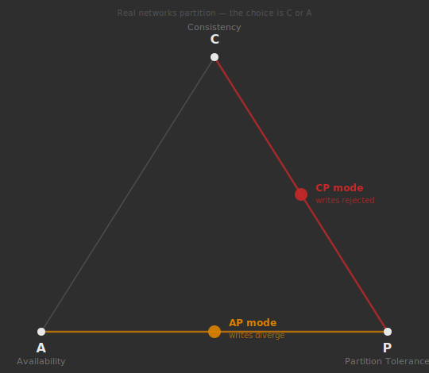
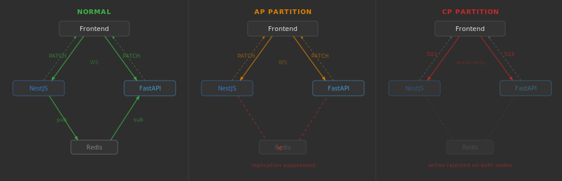
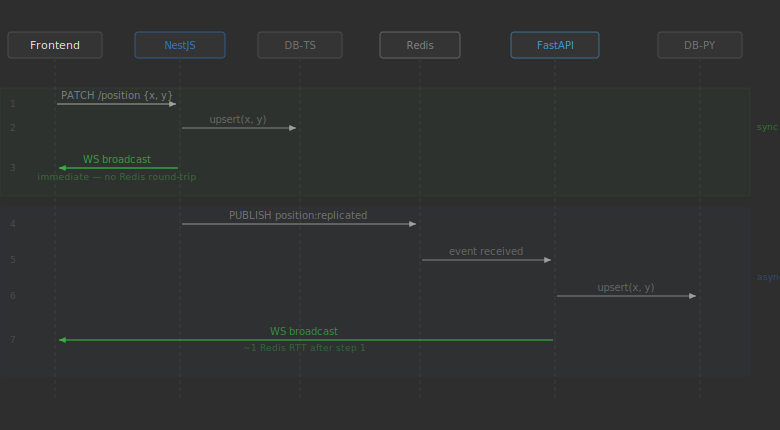

# Architecture & Design Decisions

This document explains the system's design: what it is, what it is trying to demonstrate, and the reasoning behind each architectural choice. It is intended for anyone who wants to understand the project at depth, not just run it.

## What this project is

A polyglot monorepo running two independent backends (NestJS + FastAPI) that maintain a shared logical state (the x, y position of a marker) and a React frontend that shows each backend's view of that state in real time. The purpose is to make the CAP theorem observable and interactive: users can introduce network partitions, watch the two backends' views diverge or freeze depending on the chosen consistency model, and then heal the partition and watch the system reconcile.

## The CAP theorem, briefly

The CAP theorem states that a distributed data system can provide at most two of three guarantees simultaneously:

- **C (Consistency)**: every read sees the most recent write (or an error)
- **A (Availability)**: every request receives a non-error response (data may be stale)
- **P (Partition tolerance)**: the system continues to operate when network links between nodes fail

Because real networks do fail, P is not optional in practice. The real choice is between C and A *when* a partition occurs:

- **CP systems**: sacrifice availability, rejecting operations on nodes that cannot confirm consistency with other nodes
- **AP systems**: sacrifice consistency, accepting writes and serving reads on every node even when different nodes temporarily see different data

## The multi-leader replication model

The system is designed as a **symmetric multi-leader** cluster:

- **NestJS** is one node. It owns table `positions_ts`.
- **FastAPI** is another node. It owns table `positions_py`.
- Neither backend ever reads from or writes to the other's table directly.
- **Redis** carries **replication events** between the two nodes. When a backend writes to its own table, it publishes a replication event `{ source, x, y, updated_at }` to the `position:replicated` channel. The other backend's subscriber receives this event, applies the value to its own table, and notifies its own WebSocket clients.

The shared PostgreSQL instance is the physical host for both tables but is not part of the distributed system's identity. In a real deployment these tables would live on separate servers; the demo runs them on one server for simplicity. Each backend enforces the logical boundary by only ever touching its own table.

This is a real-world pattern. Systems like Apache Cassandra, DynamoDB Global Tables, and CockroachDB use multi-leader (or "multi-master") replication: writes are accepted at any node and replicated asynchronously to peers. The CAP tradeoff appears naturally when replication fails.

### Why multi-leader rather than primary-replica

A primary-replica design (one backend accepts writes, one applies them) would mean the replica's marker is never draggable (it only shows replicated state). That limits what the demo can show: the only interesting event is "can the replica serve reads when it loses the primary?" With multi-leader, both markers are independently draggable, both backends accept independent writes, and during a partition both markers can move to different positions. The divergence is visible and interactive, which makes the demonstration more effective.

## The replication channel

The diagram below shows the symmetric nature of the cluster: either backend can receive a write from the frontend. Writes are accepted at the nearest node; the writing backend is authoritative for that write.

The writing backend commits to its own table and broadcasts to its own WebSocket clients immediately, without waiting for replication to complete. This is intentional: delaying the local broadcast until after the Redis round-trip would introduce unnecessary latency visible to the user as jitter. The other backend receives the write asynchronously; this small lag is observable on the frontend and is part of the demonstration.

The replication event payload includes a `source` field (`'ts'` or `'py'`). Each backend discards events where `source` matches itself, preventing a replication loop: NestJS publishes with `source: 'ts'`; FastAPI's subscriber ignores events with `source: 'py'`; and vice versa.

## Partition simulation

The system supports two modes of partition, selectable before the partition is triggered.

**Simulated partition** (application-layer): the frontend POSTs `{ active: true, mode: 'AP' | 'CP' }` to `/admin/partition` on both backends simultaneously. Each backend updates its in-process partition state. Redis is not touched; the simulation operates at the application layer.

**Infrastructure partition** (real): the Redis service is stopped at the infrastructure level (`docker compose stop redis` or, in Kubernetes, scaling the Redis deployment to zero). Both backends detect the lost connection independently and enter the pre-configured mode automatically. When Redis is restored, both backends detect the reconnection and the frontend auto-heals using last-write-wins without requiring user intervention — mirroring how real AP systems reconcile after a network partition heals.

In both modes, when a partition is active each backend:
- **Suppresses outgoing replication**: does not publish to Redis after a write
- **Discards incoming replication**: ignores Redis messages from the other backend

This produces the same observable effect as a real network partition: writes land only on the node that received them, and the other node's state drifts.

### AP mode (availability over consistency)

Both backends continue accepting writes. Each backend broadcasts updates to its own WebSocket clients immediately. Because replication is suppressed, the two backends' tables (and therefore the two markers on the frontend) diverge. The frontend visually shows this divergence in real time. `GET /position` returns a non-error response from both backends (available), but the values may differ (not consistent).

### CP mode (consistency over availability)

Both backends reject writes with HTTP 503. No new data is written to either table, so neither table changes and the two views remain identical (consistent). The system sacrifices availability (writes are refused) in exchange for the guarantee that no divergence occurs. Reads still succeed; CP systems typically allow reads because the data is known to be consistent (nothing has been written since the partition was activated).

### Why both backends participate in the partition simultaneously

In a real network partition, *all* nodes are affected: a partition splits the cluster, it does not selectively affect one node. Activating the partition on one backend only would produce asymmetric behavior that does not reflect reality. The frontend sends the activation to both backends in parallel so both enter the partitioned state together. In the infrastructure partition mode, symmetry emerges from the infrastructure rather than coordination: when Redis goes down, both backends independently lose connectivity to it. Detection timing differs — NestJS reacts within milliseconds via connection error events; FastAPI's async subscriber takes a few seconds longer — but the frontend enters partition mode as soon as either node detects the loss, because replication is severed the moment the first node can no longer reach Redis.

## Healing and reconciliation

When a **simulated partition** is healed, the frontend drives reconciliation:

1. Read the current local state from each backend (`GET /admin/local-state`). This returns each backend's own table value (which may differ after an AP partition).
2. Apply the user-selected heuristic to determine the winner.
3. Deactivate the partition on both backends in parallel (`POST /admin/partition { active: false }`).
4. PATCH the winner's value to the **winning backend's** `/position` endpoint.

Step 4 reuses the normal write path: the winning backend writes the winner value to its own table, broadcasts to its own WebSocket clients, and publishes a replication event to Redis. The other backend receives the replication event and applies it to its own table. Both backends converge on the winner's value. This means the heal itself demonstrates the replication path; it is not a special reconciliation bypass.

When an **infrastructure partition** heals (Redis comes back), the frontend detects that both backends report `redis.connected: true` and runs the same reconciliation flow automatically using last-write-wins. No user action is required; the event log narrates the outcome.

### Why the PATCH goes to the winner's backend

An alternative would be to PATCH both backends with the winner's value directly. This also works, but bypasses the replication path (both backends receive the value from the frontend rather than from each other). Sending it to one backend and letting replication carry it to the other is more correct: it demonstrates that after healing, the replication channel works again.

### Healing heuristics

Three heuristics are available for user-initiated heals, chosen before triggering a partition:

- **Last-write-wins (LWW)**: compare `updated_at` timestamps; the more recent write wins. This is the most common conflict resolution strategy in AP systems (used by Cassandra, DynamoDB, and Redis Cluster). It assumes clocks are reasonably synchronized and that recency is a proxy for intent.
- **NestJS wins**: NestJS's value is always applied, regardless of timestamp. Useful for demonstrating that reconciliation strategies are a design choice, not a mathematical truth.
- **FastAPI wins**: symmetric to NestJS wins.

LWW is the default because it is the strategy most commonly encountered in production AP systems and the one that requires the least explanation. Infrastructure-partition auto-heals always use LWW.

## What the frontend shows

The frontend has two `PositionBox` components, one connected to each backend. Under normal operation both boxes display the same marker position, staying in sync via replication. During a partition:

- **AP**: each box tracks its own backend's state independently. If you drag one marker, only that box moves; the other stays. Both markers are draggable. The boxes show different positions: genuine divergence.
- **CP**: neither box's marker can be moved (writes are rejected at the server). Attempting to drag a marker results in a 503 response; the marker reverts to its pre-drag position and a red flash appears on the canvas.

An event log panel narrates every event in the session: partition activation, write acceptances and rejections, replication suppression, heal initiation, heuristic decision, and reconciliation outcome. This makes the demo self-explanatory without requiring the presenter to narrate everything verbally.

Each backend also exposes a `GET /admin/status` endpoint that reports the current partition state and Redis connection health. The frontend receives status updates via the existing WebSocket connection (each backend pushes a status message on connect and on any state change) and shows a per-backend Redis health indicator, enabling the infrastructure partition mode to be demonstrated without any manual flag-setting.

## What this project does not demonstrate

This is a simulation, not a production distributed system. Some limitations worth being aware of:

- **No clock synchronization**: LWW depends on `updated_at` timestamps generated by each backend's local clock. In this single-machine setup, clocks are identical. In a real multi-region deployment, clock skew would be a real concern (addressed by systems like Google Spanner using TrueTime).
- **No actual network partition** in the simulated mode: the partition is an application-layer flag, not a real network split. Both backends can always reach the same Redis and Postgres server. The infrastructure partition mode uses a real Redis outage but still shares a single Postgres instance.
- **No quorum**: CP systems like ZooKeeper, etcd, and Raft-based systems use quorum reads and writes to distinguish majority and minority partitions. This demo does not implement quorum; CP mode simply rejects all writes unconditionally, which is correct for a two-node cluster where no quorum majority is possible.
- **No durability during partition in AP mode**: writes during an AP partition go to each backend's own table, which is durable in the PostgreSQL sense, but the *other backend's* table is stale. Reconciliation on heal may overwrite writes made by the losing backend. This is expected and is part of what AP mode means.
